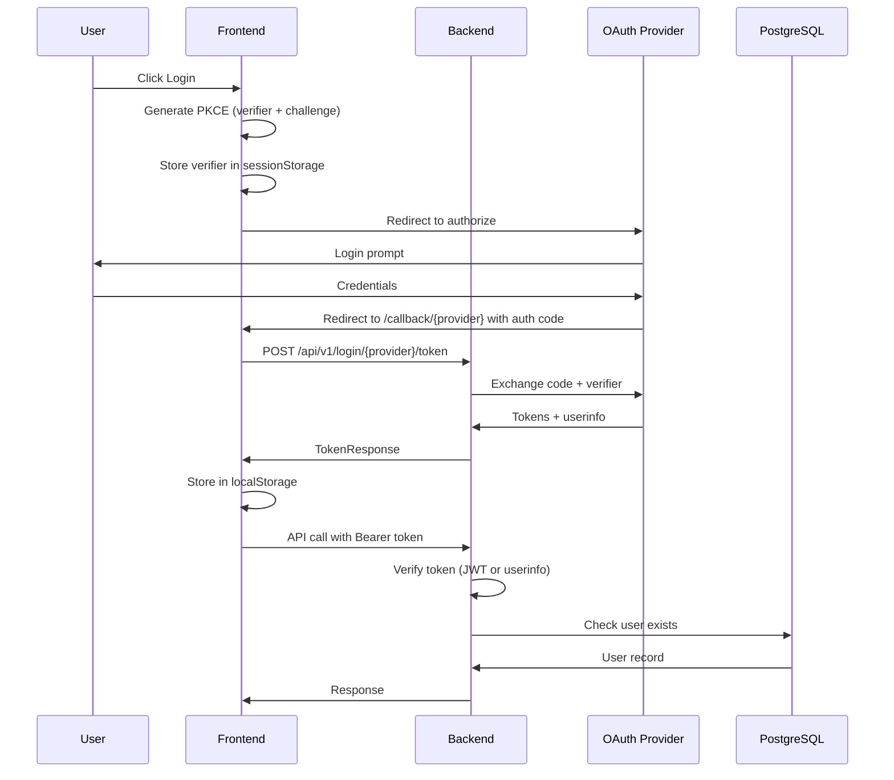

# LLM Context - Authentication Architecture

> **Note:** For login API endpoints, see `llm.user.md`. For general project context, see `llm.root.md`.

## Overview

Dual OAuth provider support (Google + Authentik) with PKCE flow. Backend validates tokens and checks user registration in database. Supports `AUTH_REQUIRED=false` mode for development (token treated as user_id directly).

## Architecture — Web Flow



## Backend Auth Files

| File | Purpose |
|------|---------|
| `middleware/token.py` | Token verification (Authentik JWT, Google userinfo) |
| `middleware/auth.py` | User lookup + role checks (`get_current_user`, `require_admin`, `require_user`) |
| `middleware/jwks.py` | JWKS fetching and Valkey caching |
| `router/api/auth.py` | OAuth token exchange endpoints + `/login/config` |
| `config/settings.py` | OAuth provider configuration |

## Frontend Auth Files

| File | Purpose |
|------|---------|
| `lib/stores/auth.store.ts` | Svelte store backed by localStorage |
| `lib/auth/auth.service.ts` | Login flow orchestration |
| `lib/auth/pkce.ts` | PKCE code generation |
| `lib/auth/providers/` | Provider-specific configs (google.ts, authentik.ts) |
| `lib/backend/auth.ts` | API client (fetchAppConfig, exchangeCodeViaBackend, fetchMe) |
| `lib/types/auth.ts` | TypeScript interfaces |
| `routes/login/+page.svelte` | Login UI |
| `routes/callback/google/+page.svelte` | Google OAuth callback |
| `routes/callback/authentik/+page.svelte` | Authentik OAuth callback |

## Token Verification Flow

```python
# middleware/token.py - verify_bearer_token()
1. Extract token from "Authorization: Bearer <token>"
2. If AUTH_REQUIRED=false: treat token as user_id, return {"email": token, "_provider": "none"}
3. Try Authentik (JWT verification via JWKS)
   - Decode JWT with RS256
   - Validate audience = client_id
   - Validate issuer = authentik URL
4. If Authentik fails, try Google (opaque token)
   - Call Google userinfo endpoint
   - Return userinfo as payload
5. Add "_provider" field to payload
6. Return payload or raise 401
```

## User Authentication Middleware

```python
# middleware/auth.py

# get_current_user - Basic auth (registered users only)
# Bearer token is resolved in order: UUID → user_name → email
async def get_current_user(token_payload, session) -> User:
    identifier = token_payload.get("sub") or token_payload.get("email")
    # If AUTH_REQUIRED=false: auto-creates user via get_or_create
    user = await UserRepository.resolve(identifier)  # tries user_id, user_name, email
    if not user:
        raise 403 "User not registered"
    return user

# get_rls_session - App session with RLS user context
# Sets app.current_user_id so Postgres RLS policies can identify the caller
async def get_rls_session(user, session):
    await session.execute(text(f"SET app.current_user_id = '{user.user_id}'"))
    yield session
    await session.execute(text("RESET app.current_user_id"))

# require_admin - Admin role required
async def require_admin(user: User) -> User:
    if user.role != "admin":
        raise 403 "Admin access required"
    return user

# require_user - User role required
async def require_user(user: User) -> User:
    if user.role != "user":
        raise 403 "Active subscription required"
    return user
```

## Frontend Auth Store

```typescript
// lib/types/auth.ts
type AuthProvider = 'authentik' | 'google' | 'none';

interface LoginInfo {
    provider: AuthProvider;
    accessToken: string;
    refreshToken?: string;
    idToken?: string;
    expiresAt?: number;
    userInfo?: { sub, email, name, picture };
    role?: string;
}

// lib/stores/auth.store.ts
// - Writable store initialized from localStorage ('loginInfo' key)
// - Auto-syncs to localStorage on changes
// - logout() clears the store
```

## PKCE Implementation

```typescript
// Frontend generates:
code_verifier: 128-char random string (alphanumeric)
code_challenge: SHA256(code_verifier) -> base64url

// Verifier stored in sessionStorage, sent to backend by callback page
```

## JWKS Caching

- Valkey key: `jwks:{provider}` (e.g., `jwks:authentik`)
- TTL: 3600 seconds (1 hour)
- Pre-warmed on backend startup
- Fallback: fetch directly if Valkey unavailable

## Environment Variables

```bash
# Google OAuth (backend + frontend build)
GOOGLE_CLIENT_ID=xxx.apps.googleusercontent.com
GOOGLE_CLIENT_SECRET=xxx

# Authentik OAuth (backend + frontend build)
AUTHENTIK_URL=https://authentik.posetmage.com
AUTHENTIK_CLIENT_ID=xxx

# Auth mode
AUTH_REQUIRED=true  # Set false for dev (skip OAuth, token = user_id)
```

> **Note:** `vite.config.ts` automatically maps these env vars to `VITE_*` prefixed vars at build time. The `BACKEND_URL` is also set automatically based on build mode (development/production).

## Database Schema

```sql
-- auth.users (identity only — UUID + role)
auth.users (
    user_id    UUID PRIMARY KEY DEFAULT gen_random_uuid(),
    role       VARCHAR NOT NULL DEFAULT 'user',  -- 'user' | 'admin'
    timestamps
)

-- gdpr.user_info (PII + handle — V40 merge of old auth.gdpr + public.user_info)
gdpr.user_info (
    user_id    UUID PK FK auth.users,
    email      VARCHAR UNIQUE NOT NULL,
    user_name  VARCHAR(32) UNIQUE NOT NULL,
    config     JSONB NOT NULL DEFAULT '{}'
)
```

**V40 merge rationale**: `auth.gdpr` and `public.user_info` are merged into a single `gdpr.user_info` row per user. All PII (email, handle, profile config) lives in one place. A GDPR purge drops that row (or the entire `gdpr` schema) without touching `auth.users` or workspace audit trails. `mgr` role (BYPASSRLS) has full CRUD — used by login/auth paths that need email. `app` role has SELECT and UPDATE on own row only via RLS (`user_id = current_user_id`). Both engines include `gdpr` in `search_path` (v40) so unqualified references to `user_info` resolve correctly.

## Adding Auth to New Endpoints

```python
from fastapi import Depends
from middleware.auth import get_current_user, require_admin, require_user
from models.user import User

# Any registered user
@router.get("/protected")
async def protected(user: User = Depends(get_current_user)):
    return {"email": user.user_id}

# Admin only
@router.post("/admin-action")
async def admin_action(user: User = Depends(require_admin)):
    return {"admin": user.user_id}

# Subscribed users only
@router.get("/premium-feature")
async def premium(user: User = Depends(require_user)):
    return {"subscriber": user.user_id}
```

## Frontend Route Protection

```svelte
<script lang="ts">
import { onMount } from 'svelte';
import { goto } from '$app/navigation';
import { authStore } from '$lib/stores/auth.store';

onMount(() => {
    if (!$authStore?.role) {
        goto('/login');
    }
});
</script>
```

## Making Authenticated API Calls

```typescript
const response = await fetch(`${BACKEND_URL}/api/v1/endpoint`, {
    headers: {
        'Authorization': `Bearer ${$authStore.accessToken}`,
        'Content-Type': 'application/json'
    }
});
```
