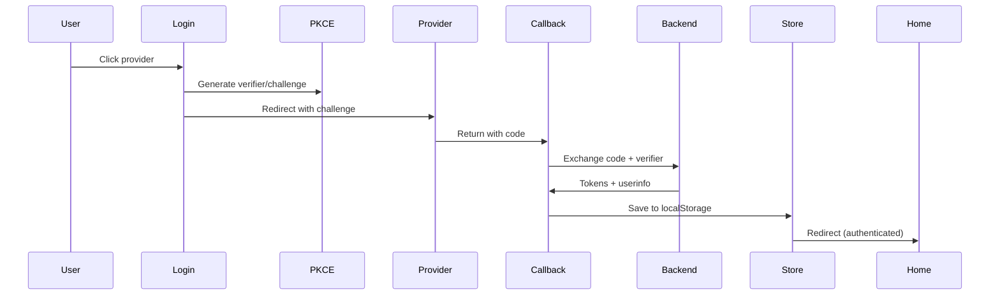

# LLM Context - Frontend

> **Note:** For general project context, see `llm.md`. For deployment, see `llm.deploy.md`.

## Tech Stack

| Technology | Version | Purpose |
|------------|---------|---------|
| SvelteKit | 2.x | Full-stack framework |
| Svelte | 5.x | Reactive UI (runes) |
| Tailwind CSS | 4.x | Utility-first styling |
| TypeScript | 5.x | Type safety |
| Vite | 7.x | Build tool |
| Playwright | 1.50.x | Browser testing |

## Directory Structure

```
frontend/src/
├── routes/                  # SvelteKit pages
│   ├── +layout.svelte       # Global layout (menu, auth)
│   ├── +page.svelte         # Home (activity tracker)
│   ├── login/+page.svelte   # OAuth login
│   ├── calendar/+page.svelte
│   ├── config/+page.svelte  # Settings
│   ├── debug/+page.svelte
│   └── callback/            # OAuth callbacks
│       ├── google/+page.svelte
│       └── authentik/+page.svelte
│
├── lib/
│   ├── auth/                # OAuth, PKCE
│   │   ├── auth.service.ts  # Login orchestration
│   │   ├── pkce.ts          # Code generation
│   │   └── providers/       # Provider configs (google.ts, authentik.ts, index.ts)
│   │
│   ├── stores/              # Svelte stores
│   │   ├── auth.store.ts    # Auth state (localStorage)
│   │   ├── settings.store.ts
│   │   ├── calendarStore.ts
│   │   ├── derivedCalendar.ts
│   │   ├── meetingsStore.ts
│   │   ├── profile.store.ts
│   │   └── questionnaire.ts
│   │
│   ├── backend/             # API clients
│   │   ├── config.ts        # BACKEND_URL
│   │   └── storage.ts       # loadJson, saveJson
│   │
│   ├── components/          # Reusable components
│   ├── types/               # TypeScript interfaces
│   └── UI/                  # Base components
│
├── app.css                  # Tailwind import
└── app.html                 # HTML template
```

## Svelte 5 Runes

```svelte
<script lang="ts">
  // Reactive state
  let count = $state(0);
  let items = $state<string[]>([]);

  // Derived values (computed)
  const doubled = $derived(count * 2);
  const itemCount = $derived(items.length);

  // Effects (side effects)
  $effect(() => {
    console.log('Count changed:', count);
    return () => console.log('Cleanup');
  });

  // Props
  let { title, onSubmit } = $props<{
    title: string;
    onSubmit: (value: string) => void;
  }>();
</script>
```

## Tailwind CSS 4

### Gradient Backgrounds
```svelte
<!-- Linear gradients (Tailwind v4 syntax) -->
<div class="bg-linear-to-br from-violet-500 via-purple-500 to-fuchsia-500">
<div class="bg-linear-to-r from-green-500 to-emerald-500">
```

### Common Patterns
```svelte
<!-- Card -->
<div class="rounded-3xl bg-white p-8 shadow-2xl">

<!-- Button -->
<button class="rounded-2xl bg-linear-to-r from-violet-500 to-fuchsia-500 px-4 py-4 font-semibold text-white transition hover:shadow-lg">

<!-- Input -->
<textarea class="w-full resize-none rounded-2xl border-2 border-gray-100 bg-gray-50 p-4 focus:border-purple-400 focus:outline-none">

<!-- Glassmorphism -->
<div class="bg-white/20 backdrop-blur-sm">
```

## Playwright Testing

### Setup
```bash
# Start browser container
docker compose --profile browser up -d browser

# Run tests
docker compose exec browser python browse.py <command>
```

### Commands
```bash
# Check page status
docker compose exec browser python browse.py status

# Take screenshot
docker compose exec browser python browse.py screenshot <name>

# List buttons
docker compose exec browser python browse.py buttons

# Open menu
docker compose exec browser python browse.py menu

# Click element (by data-testid or text)
docker compose exec browser python browse.py click "login-google"
docker compose exec browser python browse.py click "Button Text"
```

### Test IDs

Use `data-testid` attributes for reliable element selection:

```svelte
<button data-testid="menu-toggle">Menu</button>
<button data-testid="login-google">Google</button>
<button data-testid="continue-btn">Continue</button>
```

### Key Test IDs

| Element | data-testid | Location |
|---------|-------------|----------|
| Menu toggle | `menu-toggle` | +layout.svelte |
| Menu backdrop | `menu-backdrop` | +layout.svelte |
| Menu nav | `menu-nav` | +layout.svelte |
| Nav: Home | `nav-home` | +layout.svelte |
| Nav: Settings | `nav-settings` | +layout.svelte |
| Nav: Debug | `nav-debug` | +layout.svelte |
| Nav: App | `nav-open-app` | +layout.svelte |
| Nav: Chat | `nav-chat` | +layout.svelte |
| Nav: Calendar | `nav-calendar` | +layout.svelte |
| Nav: Login | `nav-login` | +layout.svelte |
| Nav: Logout | `nav-logout` | +layout.svelte |
| Login: Authentik | `login-authentik` | login/+page.svelte |
| Login: Google | `login-google` | login/+page.svelte |
| Activity input | `activity-input` | +page.svelte |
| Speak button | `btn-speak` | +page.svelte |
| Continue button | `btn-continue` | +page.svelte |
| Duration buttons | `duration-{value}` | +page.svelte |
| Emotion buttons | `emotion-{label}` | +page.svelte |
| Save button | `btn-save` | +page.svelte |

## Auth Flow



## Route Protection

```svelte
<script lang="ts">
import { onMount } from 'svelte';
import { goto } from '$app/navigation';
import { authStore } from '$lib/stores/auth.store';

onMount(() => {
  if (!$authStore?.role) {
    goto('/login');
  }
});
</script>
```

## API Calls

```typescript
import { authStore } from '$lib/stores/auth.store';

const response = await fetch(`${BACKEND_URL}/api/endpoint`, {
  headers: {
    'Authorization': `Bearer ${$authStore.accessToken}`,
    'Content-Type': 'application/json'
  }
});
```

## Storage API

```typescript
import { loadJson, saveJson } from '$lib/backend/storage';

// Load data
const data = await loadJson<MyType>('file.json');

// Save data
await saveJson('file.json', { key: 'value' });
```

## Common Tasks

### Add new route
1. Create `routes/<path>/+page.svelte`
2. Add auth check in `onMount` if protected
3. Add navigation in `+layout.svelte` menu

### Add new component
1. Create in `lib/components/`
2. Use Svelte 5 runes for state
3. Add `data-testid` for testable elements

### Add new store
1. Create in `lib/stores/`
2. Use `$state()` for reactive values
3. Sync to localStorage if needed
