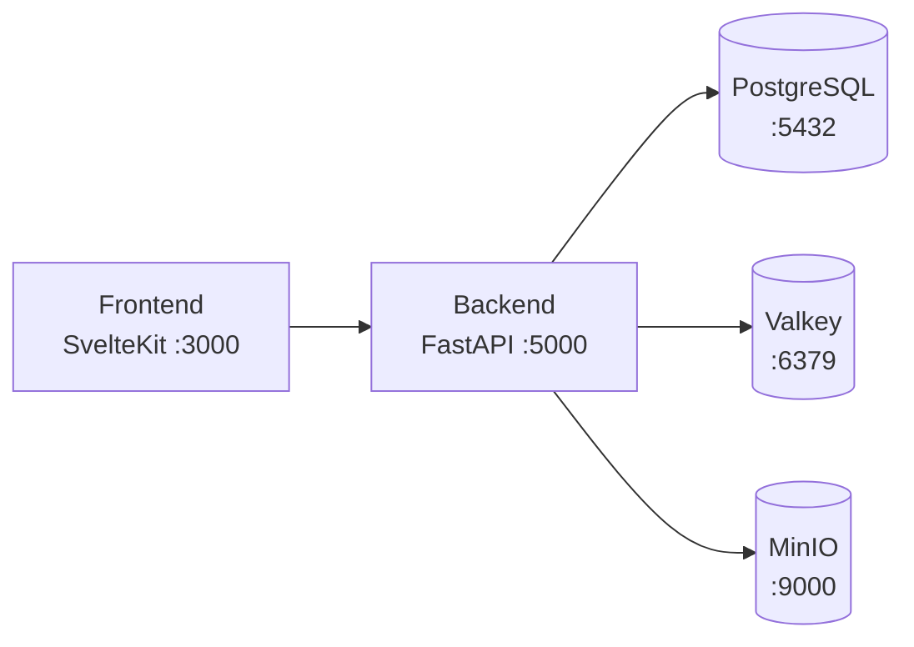

# LLM Context - Lattice Cast

## Project Overview

Full-stack wellness tracking application.

**Domain:** `lattice-cast.posetmage.com`

> **Documentation:**
> - `llm.dev.md` - Development guide (local workflow, curl testing)
> - `llm.frontend.md` - Frontend (Svelte 5, Tailwind CSS 4, Playwright)
> - `llm.arch.auth.md` - Authentication architecture (OAuth, JWT, PKCE, middleware)
> - `llm.endpoint.md` - API endpoints reference
> - `llm.storage.md` - Storage system (MinIO, user history)
> - `llm.user.md` - User management (login API, admin API)
> - `llm.deploy.md` - Docker Compose, Kubernetes deployment

## Tech Stack

| Layer | Technology |
|-------|------------|
| Frontend | SvelteKit 2.x, Svelte 5, Tailwind CSS 4, TypeScript, Vite 7 |
| Backend | FastAPI, Python 3.12, Uvicorn |
| Database | PostgreSQL 18, SQLModel/SQLAlchemy async |
| Cache | Valkey 8 (alpine) |
| Storage | MinIO (S3-compatible), boto3 |
| Auth | Google OAuth, Authentik |
| Containers | Docker Compose (dev), Kubernetes (prod) |

## Architecture



## Directory Structure

**Note:** Backend uses flat imports without `__init__.py` files.

```
lattice-cast/
├── backend/                  # Git submodule - FastAPI + Python 3.12
│   └── src/
│       ├── main.py           # App entry, routers, lifespan
│       ├── core/             # db.py, persona.py, companionship.py
│       ├── config/           # settings.py, redis.py, storage.py
│       ├── middleware/       # auth.py, token.py, jwks.py
│       ├── models/           # SQLModel schemas (ORM mapping only)
│       ├── repository/       # CRUD operations
│       ├── router/api/       # auth.py, storage.py
│       ├── router/api/admin/ # users.py
│       ├── util/             # security.py, logger.py
│       └── log/              # Auto-created daily log files
│
├── frontend/                 # Git submodule - SvelteKit + Tailwind CSS
│   └── src/
│       ├── routes/           # +page.svelte, calendar/, etc.
│       └── lib/
│           ├── auth/         # OAuth, PKCE implementation
│           ├── stores/       # Svelte stores (auth, calendar, etc.)
│           ├── backend/      # Backend API (storage, auth)
│           ├── components/   # Reusable Svelte components
│           ├── types/        # TypeScript interfaces
│           └── UI/           # Button, Input, Label components
│
├── migration/                # *.sql files for DB schema (source of truth)
├── k8s/                      # Kubernetes manifests
├── browser/                  # Playwright browser automation
├── docker-compose.yml
├── llm.md                    # This file
├── llm.dev.md                # Development guide
├── llm.frontend.md           # Frontend documentation
├── llm.arch.auth.md          # Auth architecture
├── llm.endpoint.md           # API endpoints documentation
├── llm.storage.md            # Storage system documentation
├── llm.user.md               # User management (login, admin)
├── llm.deploy.md             # Deployment documentation
└── .env
```

## Database Schema

### users
```sql
uuid        UUID PRIMARY KEY DEFAULT gen_random_uuid()
id          VARCHAR UNIQUE INDEX  -- email address
role        VARCHAR DEFAULT 'user' INDEX
created_at  TIMESTAMP
updated_at  TIMESTAMP
```

### user_personas (TODO)
```sql
user_id     -- foreign key to users
persona     -- persona data (JSON)
```

### companionship_logs (TODO)
```sql
user_id     -- foreign key to users
date        -- log date
data        -- log data
```

## Key Patterns

### Backend
- **Flat imports**: No `__init__.py` files
- **Pydantic Settings**: Centralized config in `config/settings.py`
- **SQL migrations**: Use `migration/*.sql`, not auto-create
- **Async everywhere**: asyncpg, httpx, redis-py
- **OpenAPI**: Auto-generated at `/docs`, `/redoc`

### Frontend
See `llm.frontend.md` for details on Svelte 5, Tailwind CSS 4, and Playwright testing.

## Common Tasks

### Add new API endpoint
1. Create router in `backend/src/router/api/`
2. Add to `main.py` via `app.include_router()`
3. Use auth: `user: User = Depends(get_current_user)`

### Add new database table
1. Create `migration/*.sql` file
2. Define SQLModel in `models/`
3. **Never use auto-create**

### Add new frontend route
See `llm.frontend.md` for Svelte 5 patterns and Playwright testing.
